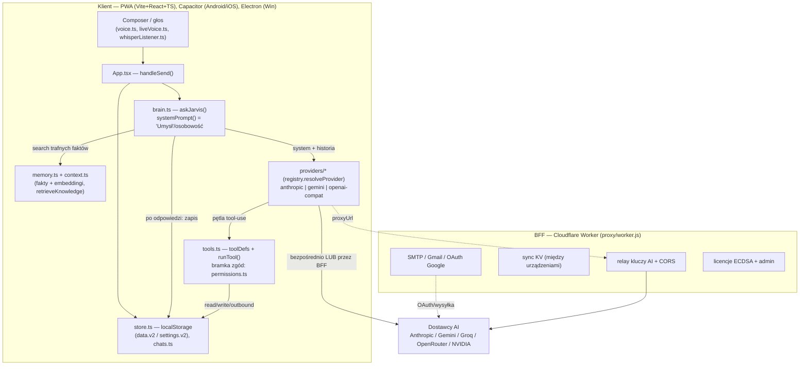

# JARVIS — ARCHITECTURE

> Stan faktyczny repo (zweryfikowany w kodzie, Faza 0). **Korekta względem briefu:** backend to
> **Cloudflare Worker** (`proxy/worker.js`), nie „Node.js za tunelem"; modele to **multi-provider**
> (Anthropic / Gemini / OpenAI-compat: Groq, OpenRouter, NVIDIA, GitHub Models), nie tylko Groq.

## Przepływ wiadomości (UI → backend → model → odpowiedź)

## Komponenty (gdzie co jest)
- **„Umysł"/osobowość:** `brain.ts` `systemPrompt(ctx)` składa personę + profil (`profile.ts`) +
  pamięć (`memory.ts`) + wiedzę (`retrieveKnowledge`) + dziennik. Wspomaganie: `cognition.ts`,
  `council.ts` (multi-model), `autoPlan.ts`.
- **Integracje Calendar/Gmail:** `google.ts` (OAuth przez BFF), `deviceCalendar.ts`,
  `deviceContacts.ts`; desktop natywnie (`electron/google.cjs`). **Dziś ręcznie, nie MCP.**
- **Mikrofon/kamera:** `voice.ts` (TTS/STT), `liveVoice.ts` (**Gemini Live WS + barge-in — już
  działa**), `whisperListener.ts`/`voiceCapture.ts` (VAD), `mic.ts` (uprawnienia), Capacitor
  Camera; Android `WakeWordService` (nasłuch w tle). Manifest ma RECORD_AUDIO/CAMERA.
- **Stan/pamięć między sesjami:** `localStorage` (`jarvis.data.v2`, `jarvis.settings.v2`,
  `jarvis.chats.v1`) + sync KV w Workerze. Embeddingi pamięci w store (limit ~5 MB — dług).
- **Sekrety:** `store.settings` (localStorage; klucze BYOK — *plaintext, dług bezpieczeństwa*),
  `vite.config.ts` `__DEFAULT_KEYS__` = **puste**, sekrety serwerowe w env Workera. `.env.example`:
  `proxy/.dev.vars.example`, `sales-os/.env.example` (klient nie ma `.env`).

## Główny dług techniczny (skrót — pełny w `AUDIT.md`)
- localStorage jako baza (sufit ~5 MB, embeddingi go zjadają) → docelowo IndexedDB / realna baza.
- Wielkie pliki (`App.tsx` ~1050, `tools.ts` ~1280, `Settings` ~1600), miejscami silne powiązania.
- Bezpieczeństwo decyzyjne (keystore w repo, sekret admina = nr tel., BFF otwarty bez `APP_TOKEN`) —
  lista w `SECURITY.md`.
- Brak: Mem0/Qdrant, MCP, Mastra, OpenRouter, telemetrii kosztów, modelu on-device (to net-new fazy).

## Punkty zaczepienia (dla nadchodzących faz)
| Faza | Punkt zaczepienia w obecnym kodzie |
|---|---|
| **1 Pamięć (Mem0+Qdrant)** | `brain.ts` `prepareMemoryContext()` (search PRZED) + zapis PO odpowiedzi; `memory.ts` jako warstwa do podmiany na `MemoryService`. |
| **2 MCP** | `tools.ts` `toolDefs` + pętla `runTool` w `providers/*`. `McpManager` rejestruje narzędzia MCP do `toolDefs` i routuje `runTool`→MCP. Allowlista + `permissions.ts`. |
| **3 Głos live** | `liveVoice.ts` `LiveSession` (Gemini Live WS + barge-in **istnieje**); dopiąć narzędzia MCP + Mem0; uprawnienia `mic.ts`/manifest; fallback do tekstu w `voiceLoop.ts`. |
| **4 Mastra + router** | `brain.ts` `resolveProvider` + `registry.ts` `autoPick`/failover; router modeli na Groq (Scout vs Kimi) z logowaniem; agent = warstwa nad obecną pętlą. |
| **5 Panel kosztów** | middleware wokół `providers/*` `impl()` (tokeny/latencja/status); `usage.ts`/`apiStatus.ts` jako baza; nowy route/ekran. |
| **6 Saldo/OpenRouter** | nowy provider OpenRouter w `registry.ts`; saldo z OpenRouter API; **STOP przy płatnościach**. |
| **7 Proaktywność/epizody** | istnieją ticki w `App.tsx` (briefing/prospect) + `notifyCenter.ts`; dołożyć epizody do pamięci. |
| **8 On-device** | `privateMode.ts` (już przełącza na Ollama); dołożyć lokalny GGUF + lokalną pamięć. |

*Faza 0 = dokumentacja. Bez zmian w kodzie aplikacji.*
